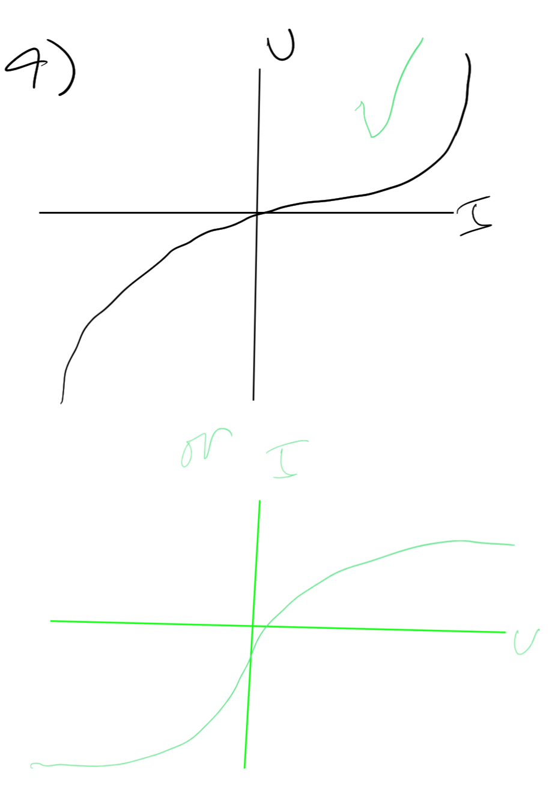
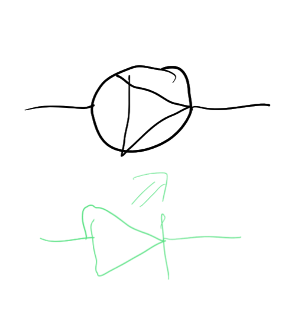
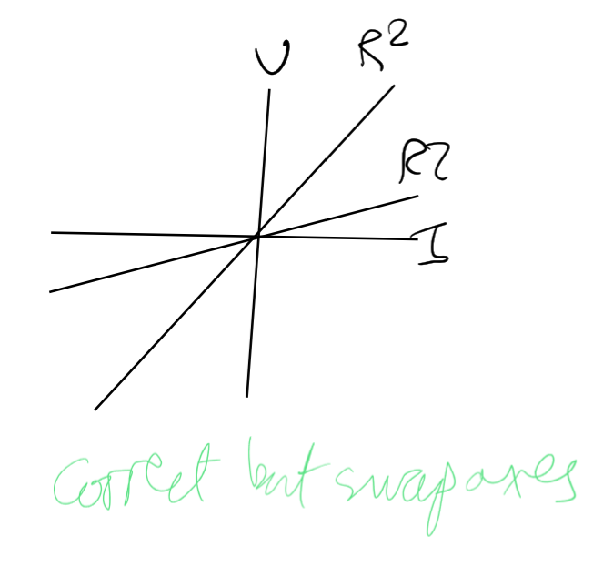
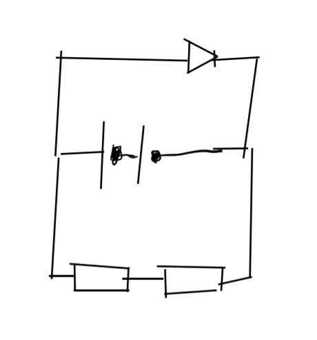
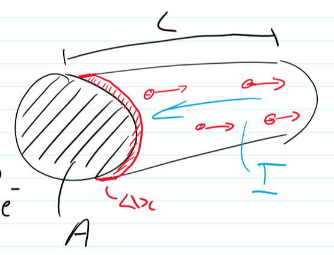
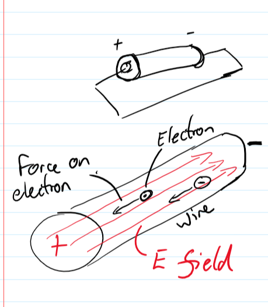

- #physics
- GCSE Recap
	- Working from 
	- Easy
		- 1
			- The flow of electrons  **rate of flow of charge - close but not quite, also:** $I=\frac{Q}{t}$
		- 2
			- $V = IR$
		- 3
			- $P = IV = 5 * 2 = 10W$
		- 4
			- 
		- 5
			- 
		- 6
	- Getting Harder
		- 1
			- The number of joules per coulomb **or energy transferred over number =>** $V = \frac{E}{Q}$
		- 2
			- Coulomb
		- 3
			- ?? **In a closed circuit, resistance is directly proportional to current**
		- 4
			- 
		- 5
			- $V_1 = 6V, V_2 = 6V$
	- A bit difficult?
		- 1
			- $R_{total} = 5 + 1 = 6Ω$
			  $V_1 = 12 * \frac{1}{6} = 2V$
			  $V_2 = 12 * \frac{5}{6} = 10V$
		- 2
			- $V = IR, I = V/R$
			  $I_1 = 6 / 2 = 3A$
			  $I_2 = 6/3 = 2A$
		- 3
			- No change as measuring from fixed resistor.
			  **no - resistance in whole circuit changes, so gets lower, because LDR gets more voltage so Fixed Resistor gets less voltage**
		- 4
			- 
	- Extension
		- 1
			- a
				- $3V$
			- b
				- $R_{total} = 1 + 1 = 2 Ω$
				  $V = 3 * \frac{1}{2} = 1.5V$
			- c
				- $1 / R_{total} = \frac{1}{R_1} + \frac{1}{R_2} + \ldots$
				  $1/x = 1/3 + 1/2 = 5/6$
				  $x = 6/5 = 1.2Ω$
- Current & Drift Velocity
	- $I = \frac{\Delta Q}{\Delta t}, V = \frac{E}{Q}, V=IR$
	- # What actually drains electrons round the circuit?
		- When a complete conductive loop is made from positive to negative there is an electric field that passes through the wire. This has the effect of producing a force on charge carriers, moving the delocalised electrons in metals. All electrons move together immediately.
		- 
		- 
		- Electrons are our charge carriers in electric circuits. They have a charge of $-1.6*10^{-19}C$. For example, when *charging* the Van de Graff generator for 10s, it gained a charge of $304 nC$. We can divide the charge by the magnitude of one electron, and then divide that by the time taken to get the number of electrons that were transferred to the Van de Graff generator: $1.9*10^{12}$.