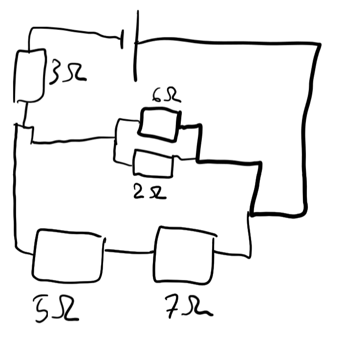

- Picture:
  collapsed:: true
	- 
- $$R_{Top} = \frac{1}{\frac{1}{6} + \frac{1}{2}} = 1.5\Omega$$
  $$R_{Btm} = 5 + 7 = 12\Omega$$
  $$R_{main} = \frac{1}{\frac{1}{1.5} + \frac{1}{12}} = \frac{4}{3}\Omega$$
  $$R = 3 + \frac{4}{3} = 4.3\Omega$$