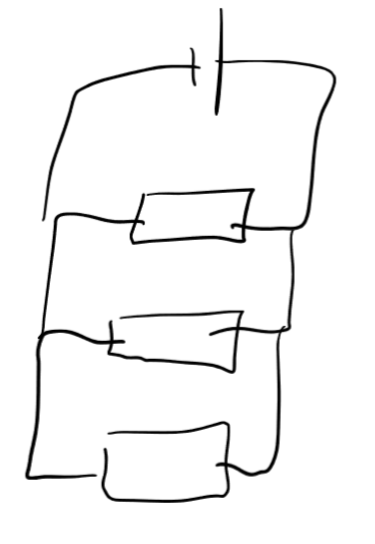

- Most current will go through the smaller resistor, but some will go through the larger resistances, and so the electron density for each path is smaller, decreasing the overall resistance compared to if they were in series.
- Equation: #card
	- $$\frac{1}{R_T} = \frac{1}{R_1} + \frac{1}{R_2} + \ldots + \frac{1}{R_n}$$
- Photo:
  collapsed:: true
	- 
- Also see [Calculator Program](https://github.com/Epacnoss/calculator-programs/blob/main/ParaResist.py)